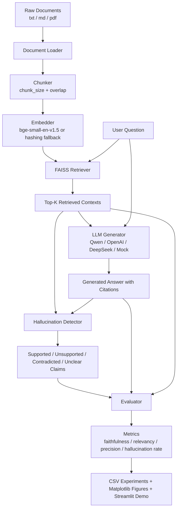

# RAG Hallucination Eval

> English version follows the Chinese version.

## 中文版

### 项目简介

RAG Hallucination Eval 是一个面向 RAG 问答系统的幻觉检测与自动评测项目。普通 RAG 系统通常只负责“检索文档并生成答案”，但无法保证答案中的每个事实都被检索上下文支持。本项目在 RAG 生成答案之后，继续执行 claim 级别的事实一致性检测，识别 `supported`、`unsupported`、`contradicted`、`unclear` 片段，并计算 hallucination rate、faithfulness、answer relevancy、context precision、citation accuracy 等指标。

项目支持本地 mock/fallback 模式，也支持 OpenAI-compatible 的 Qwen API 调用。即使没有真实 API key 或无法下载 Hugging Face embedding 模型，项目也能通过 deterministic hashing embedding 与 fallback evaluator 完整跑通。

### 项目结构图

```text
rag-hallucination-eval/
├── app/
│   └── streamlit_app.py              # Streamlit 可视化 Demo
├── data/
│   ├── eval_set.json                 # 示例评测集
│   ├── processed/                    # 向量库持久化目录
│   └── raw_docs/
│       └── sample_llm_notes.md       # 示例知识库文档
├── experiments/
│   ├── run_baseline.py               # Baseline 实验
│   ├── run_ablation.py               # 消融实验
│   └── plot_results.py               # 结果可视化
├── src/
│   ├── config.py                     # 环境变量与全局配置
│   ├── document_loader.py            # txt/md/pdf 文档加载
│   ├── chunker.py                    # 文本切分
│   ├── embedder.py                   # embedding 与 hashing fallback
│   ├── retriever.py                  # FAISS 检索器
│   ├── generator.py                  # LLM 答案生成
│   ├── hallucination_detector.py     # 幻觉检测
│   ├── evaluator.py                  # 自动评测
│   └── pipeline.py                   # 端到端主流程
├── tests/                            # Pytest 单元测试
├── .env.example                      # 环境变量模板
├── requirements.txt
└── README.md
```

### 系统架构图



### 底层原理

1. **文档加载**
   `document_loader.py` 将 `.txt`、`.md`、`.pdf` 统一转换为 `Document` 对象，每个对象保留 `text`、`source`、`page` 和 `metadata`。PDF 按页解析，空文件和不支持的格式会被跳过并给出 warning。

2. **文本切分**
   `chunker.py` 使用固定窗口和 overlap 切分文本，生成 `Chunk` 对象。chunk 会保留原始文档来源、页码和 `chunk_id`，便于后续引用和追踪。

3. **向量检索**
   `embedder.py` 默认尝试加载 `BAAI/bge-small-en-v1.5`。如果模型无法下载或加载失败，会自动切换到 deterministic hashing embedding。`retriever.py` 使用 FAISS 建立向量索引，按 query 返回 top-k 相关 chunk。

4. **答案生成**
   `generator.py` 使用严格 prompt 要求模型只基于 retrieved contexts 回答，并尽量使用 `[1]`、`[2]` 等引用。如果没有 API key，可使用 mock mode 保证本地测试流程可跑通。当前已支持 Qwen 的 OpenAI-compatible endpoint。

5. **幻觉检测**
   `hallucination_detector.py` 将答案拆成 sentence/claim 级片段，并判断每个 claim 是否被上下文支持。当前稳定版本使用本地 fallback 判断，也预留了 Qwen LLM-as-a-Judge 入口。

6. **自动评测**
   `evaluator.py` 计算：
   - `faithfulness = 1 - hallucination_rate`
   - `answer_relevancy`
   - `context_precision`
   - `citation_accuracy`
   - `hallucination_rate`

7. **实验与可视化**
   `run_baseline.py` 执行基础 RAG 评测；`run_ablation.py` 比较 chunk size、top-k、query rewrite、reranker 开关；`plot_results.py` 生成图表；`streamlit_app.py` 提供可交互 Demo。

### 使用方法

#### 1. 安装环境

```bash
python3 -m venv .venv
source .venv/bin/activate
pip install -r requirements.txt
cp .env.example .env
```

#### 2. 配置 Qwen API

编辑 `.env`：

```bash
LLM_PROVIDER=qwen
QWEN_API_KEY=your_qwen_api_key
QWEN_MODEL=qwen-plus
MOCK_LLM=false
```

如果只想本地测试，不调用真实 API：

```bash
MOCK_LLM=true
```

#### 3. 运行测试

```bash
python -m pytest
```

#### 4. 运行 Baseline

```bash
python experiments/run_baseline.py
```

输出：

```text
results/baseline_results.csv
```

#### 5. 运行消融实验

```bash
python experiments/run_ablation.py
```

输出：

```text
results/ablation_results.csv
results/ablation_runs/
```

#### 6. 生成图表

```bash
python experiments/plot_results.py
```

输出：

```text
results/figures/chunk_size_hallucination_rate.png
results/figures/top_k_faithfulness.png
results/figures/baseline_vs_reranker.png
results/figures/baseline_vs_query_rewrite.png
```

#### 7. 启动 Streamlit Demo

```bash
streamlit run app/streamlit_app.py
```

打开：

```text
http://localhost:8501
```

在页面中点击 `Build Index`，输入问题，再点击 `Ask`，即可查看答案、检索上下文、unsupported spans 和评测指标。

### 当前结果

本地 fallback baseline 已通过完整流程，当前示例数据上的结果为：

| Metric | Value |
|---|---:|
| avg_faithfulness | 1.0000 |
| avg_answer_relevancy | 0.3919 |
| avg_context_precision | 0.4000 |
| avg_hallucination_rate | 0.0000 |

已验证：

- `pytest` 通过
- baseline 可运行
- ablation 可运行
- plot results 可生成图表
- Streamlit 页面可启动
- Qwen API smoke test 可真实调用

### 局限与后续改进

- Query rewrite 和 reranker 当前是可选开关，占位接入，尚未实现真实策略。
- LettuceDetect、DeepEval、Ragas 当前未作为强依赖接入，系统优先使用稳定 fallback。
- 本地 fallback evaluator 基于 lexical overlap，适合跑通流程，不等价于高精度语义评测。
- 后续可接入 cross-encoder reranker、真实 query rewrite、LettuceDetect 和 Ragas/DeepEval。

---

## English Version

### Project Overview

RAG Hallucination Eval is a retrieval-augmented generation project designed to detect and evaluate whether generated answers are supported by retrieved context. A standard RAG system retrieves documents and generates answers, but it does not guarantee that every generated claim is grounded in the retrieved evidence. This project adds claim-level hallucination detection and automatic evaluation after answer generation.

The system identifies `supported`, `unsupported`, `contradicted`, and `unclear` answer spans, then reports hallucination rate, faithfulness, answer relevancy, context precision, and citation accuracy.

It supports local mock/fallback execution and OpenAI-compatible Qwen API calls. If no API key is configured or Hugging Face embedding weights cannot be downloaded, the system still runs end to end with deterministic hashing embeddings and fallback metrics.

### Project Structure

```text
rag-hallucination-eval/
├── app/
│   └── streamlit_app.py              # Streamlit demo
├── data/
│   ├── eval_set.json                 # Sample evaluation set
│   ├── processed/                    # Vector store output directory
│   └── raw_docs/
│       └── sample_llm_notes.md       # Sample knowledge document
├── experiments/
│   ├── run_baseline.py               # Baseline experiment
│   ├── run_ablation.py               # Ablation experiment
│   └── plot_results.py               # Result visualization
├── src/
│   ├── config.py                     # Environment and runtime settings
│   ├── document_loader.py            # txt/md/pdf document loader
│   ├── chunker.py                    # Text splitter
│   ├── embedder.py                   # Embedding and hashing fallback
│   ├── retriever.py                  # FAISS retriever
│   ├── generator.py                  # LLM answer generation
│   ├── hallucination_detector.py     # Hallucination detection
│   ├── evaluator.py                  # Automatic evaluation
│   └── pipeline.py                   # End-to-end pipeline
├── tests/
├── .env.example
├── requirements.txt
└── README.md
```

### Architecture


### Core Principles

1. **Document Loading**
   `document_loader.py` normalizes `.txt`, `.md`, and `.pdf` files into `Document` objects with text, source, page, and metadata. PDFs are parsed page by page.

2. **Chunking**
   `chunker.py` splits documents into overlapping character chunks while preserving source metadata and chunk IDs.

3. **Vector Retrieval**
   `embedder.py` tries to use `BAAI/bge-small-en-v1.5` by default. If model loading fails, it falls back to deterministic hashing embeddings. `retriever.py` uses FAISS for top-k similarity retrieval.

4. **Answer Generation**
   `generator.py` builds a strict context-grounded prompt and supports OpenAI-compatible providers such as Qwen. It also supports mock generation for local testing.

5. **Hallucination Detection**
   `hallucination_detector.py` splits answers into claims and judges whether each claim is supported by retrieved context. The stable version uses a local fallback and keeps a Qwen LLM-as-a-Judge path available.

6. **Automatic Evaluation**
   `evaluator.py` computes faithfulness, answer relevancy, context precision, citation accuracy, and hallucination rate.

7. **Experiments and Demo**
   Baseline and ablation experiments write CSV outputs. Plot scripts generate Matplotlib figures. The Streamlit app provides an interactive interface.

### Usage

#### 1. Install

```bash
python3 -m venv .venv
source .venv/bin/activate
pip install -r requirements.txt
cp .env.example .env
```

#### 2. Configure Qwen

Edit `.env`:

```bash
LLM_PROVIDER=qwen
QWEN_API_KEY=your_qwen_api_key
QWEN_MODEL=qwen-plus
MOCK_LLM=false
```

For local-only execution:

```bash
MOCK_LLM=true
```

#### 3. Run Tests

```bash
python -m pytest
```

#### 4. Run Baseline

```bash
python experiments/run_baseline.py
```

#### 5. Run Ablation

```bash
python experiments/run_ablation.py
```

#### 6. Plot Results

```bash
python experiments/plot_results.py
```

#### 7. Start Streamlit

```bash
streamlit run app/streamlit_app.py
```

Open:

```text
http://localhost:8501
```

Click `Build Index`, enter a question, and click `Ask` to inspect the answer, retrieved contexts, unsupported spans, and evaluation metrics.

### Current Results

Current local fallback baseline on the sample dataset:

| Metric | Value |
|---|---:|
| avg_faithfulness | 1.0000 |
| avg_answer_relevancy | 0.3919 |
| avg_context_precision | 0.4000 |
| avg_hallucination_rate | 0.0000 |

Validated:

- Pytest passes
- Baseline experiment runs
- Ablation experiment runs
- Plot script generates figures
- Streamlit demo starts
- Qwen API smoke test succeeds

### Limitations and Future Work

- Query rewrite and reranker switches are currently placeholders.
- LettuceDetect, DeepEval, and Ragas are planned optional integrations, not required by the stable fallback version.
- The fallback evaluator uses lexical overlap and is not equivalent to a strong semantic evaluator.
- Future work includes real query rewriting, cross-encoder reranking, LettuceDetect, and Ragas/DeepEval integrations.
