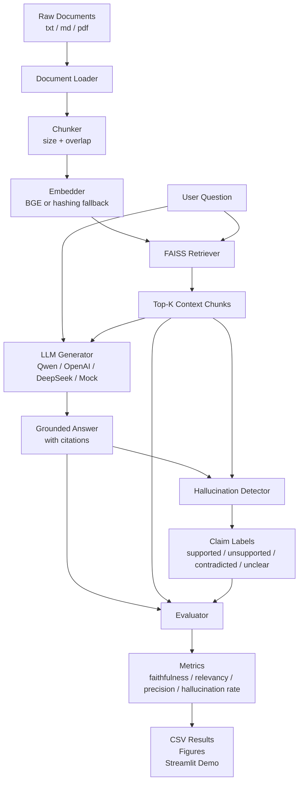

# RAG Hallucination Eval


> A local-first RAG evaluation project for detecting unsupported claims in generated answers.
>
> 中文版在前，English version follows.

## 中文版

### 项目简介

RAG Hallucination Eval 是一个面向 RAG 问答系统的幻觉检测与评测项目。它先对本地文档建立向量索引，再根据用户问题检索相关上下文，调用 LLM 生成带引用的答案，最后把答案拆成 claim/sentence 级片段，判断每个片段是否被检索上下文支持。

项目默认支持 Qwen 的 OpenAI-compatible API，也保留 OpenAI、DeepSeek 和 mock 模式。即使没有 API Key，或本地无法下载 Hugging Face embedding 模型，也可以通过 mock LLM 与 deterministic hashing embedding 跑通完整流程。

### 核心功能

| 模块 | 说明 |
|---|---|
| 文档加载 | 读取 `.txt`、`.md`、`.pdf`，统一转换为内部 `Document` 对象 |
| 文本切分 | 按 chunk size 与 overlap 切分文本，并保留 source、page、chunk_id |
| 向量检索 | 默认使用 `BAAI/bge-small-en-v1.5`，失败时自动切换 hashing embedding |
| 答案生成 | 使用严格 grounding prompt，要求答案只基于检索上下文并尽量带 `[1]` 引用 |
| 幻觉检测 | 输出 `supported`、`unsupported`、`contradicted`、`unclear` 级别的判断 |
| 自动评测 | 计算 faithfulness、answer relevancy、context precision、citation accuracy、hallucination rate |
| 实验脚本 | 支持 baseline、chunk/top-k 消融实验和 Matplotlib 图表生成 |
| Web Demo | Streamlit 页面可交互构建索引、提问、查看上下文和评测指标 |

### 项目结构

```text
rag-hallucination-eval/
├── app/
│   └── streamlit_app.py              # Streamlit demo
├── data/
│   ├── eval_set.json                 # 示例评测集
│   ├── processed/                    # FAISS 索引输出目录
│   └── raw_docs/
│       └── sample_llm_notes.md       # 示例知识库文档
├── experiments/
│   ├── run_baseline.py               # baseline 评测
│   ├── run_ablation.py               # chunk/top-k 消融实验
│   └── plot_results.py               # 结果图表生成
├── src/
│   ├── config.py                     # 环境变量与运行配置
│   ├── document_loader.py            # txt/md/pdf 文档加载
│   ├── chunker.py                    # chunk 切分逻辑
│   ├── embedder.py                   # embedding 与 fallback
│   ├── retriever.py                  # FAISS 检索器
│   ├── generator.py                  # LLM 答案生成
│   ├── hallucination_detector.py     # claim 级幻觉检测
│   ├── evaluator.py                  # 自动评测指标
│   └── pipeline.py                   # 端到端流程编排
├── tests/                            # pytest 测试
├── .env.example                      # 环境变量模板
├── requirements.txt                  # Python 依赖
└── README.md
```

### 架构图



### 底层原理

1. **文档标准化**  
   `src/document_loader.py` 把原始文档转换为统一的 `Document` 数据结构。PDF 会按页解析，文本类文件会保留来源路径，后续每个 chunk 都可以追溯到原始文档。

2. **切分与元数据传递**  
   `src/chunker.py` 使用固定窗口和 overlap 切分文本。chunk 不只是文本片段，还带有 `source`、`page`、`chunk_id` 等元数据，用于检索、引用和评测。

3. **向量索引与 fallback**  
   `src/embedder.py` 优先加载 sentence-transformers 模型。如果模型不可用，系统使用确定性的 hashing embedding，让测试和 demo 不依赖外部模型下载。`src/retriever.py` 使用 FAISS 做 top-k 相似度检索。

4. **上下文约束生成**  
   `src/generator.py` 构造固定 prompt，要求模型只使用检索上下文回答，信息不足时返回上下文不足。Qwen 通过 `https://dashscope.aliyuncs.com/compatible-mode/v1` 这个 OpenAI-compatible endpoint 调用。

5. **claim 级幻觉检测**  
   `src/hallucination_detector.py` 把答案拆为更小的判断单元，再和检索上下文对齐。当前稳定路径包含本地 fallback 判断，同时预留 Qwen LLM-as-a-Judge 的入口。

6. **指标计算**  
   `src/evaluator.py` 基于答案、上下文和检测结果计算多个指标。fallback evaluator 主要使用 lexical overlap，适合本地可复现评测；若要更高语义精度，可以继续接入 Ragas、DeepEval 或专用 judge model。

### 快速开始

```bash
python3 -m venv .venv
source .venv/bin/activate
pip install -r requirements.txt
cp .env.example .env
python -m pytest
```

### 环境变量

编辑 `.env`。真实密钥只保存在本地，不要提交到 GitHub。

| 变量 | 默认值 | 说明 |
|---|---|---|
| `LLM_PROVIDER` | `qwen` | 可选 `qwen`、`openai`、`deepseek`、`mock` |
| `QWEN_API_KEY` | `your_key` | Qwen API Key |
| `QWEN_MODEL` | `qwen-plus` | Qwen 模型名 |
| `OPENAI_API_KEY` | `your_key` | OpenAI API Key |
| `DEEPSEEK_API_KEY` | `your_key` | DeepSeek API Key |
| `EMBEDDING_MODEL` | `BAAI/bge-small-en-v1.5` | sentence-transformers 模型 |
| `VECTOR_STORE_PATH` | `data/processed/faiss_index` | FAISS 索引输出路径 |
| `DEFAULT_CHUNK_SIZE` | `512` | 默认 chunk 大小 |
| `DEFAULT_CHUNK_OVERLAP` | `80` | 默认 chunk overlap |
| `DEFAULT_TOP_K` | `5` | 默认检索数量 |
| `MOCK_LLM` | `false` | 设置为 `true` 可不调用真实 API |

Qwen 示例配置：

```bash
LLM_PROVIDER=qwen
QWEN_API_KEY=your_qwen_api_key
QWEN_MODEL=qwen-plus
MOCK_LLM=false
```

本地离线测试配置：

```bash
MOCK_LLM=true
```

### 使用方法

运行 baseline：

```bash
python experiments/run_baseline.py
```

运行消融实验：

```bash
python experiments/run_ablation.py
```

生成图表：

```bash
python experiments/plot_results.py
```

启动 Web Demo：

```bash
streamlit run app/streamlit_app.py
```

打开 `http://localhost:8501`，点击 `Build Index`，输入问题后点击 `Ask`，即可查看生成答案、检索上下文、unsupported spans 和评测指标。

### 输出文件

| 路径 | 内容 |
|---|---|
| `results/baseline_results.csv` | baseline 评测结果 |
| `results/ablation_results.csv` | 消融实验汇总 |
| `results/ablation_runs/` | 每组消融配置的详细结果 |
| `results/figures/` | Matplotlib 输出图表 |
| `data/processed/faiss_index*` | 本地 FAISS 索引文件 |

### 当前验证状态

已在本地验证：

```text
19 passed, 1 warning
```

### 已知限制

- Query rewrite 与 reranker 目前是实验开关，占位接入，尚未实现真实改写和重排策略。
- fallback evaluator 基于词面重叠，不等同于强语义评测。
- Ragas、DeepEval、LettuceDetect 目前不是稳定流程的必需依赖。
- 项目当前没有检测到 `LICENSE` 文件；正式开源建议补充许可证。

---

## English Version

### Overview

RAG Hallucination Eval is a local-first evaluation project for retrieval-augmented generation systems. It builds a vector index from local documents, retrieves relevant context for a user question, asks an LLM to generate a citation-aware answer, and then checks whether each answer claim is supported by the retrieved context.

The default provider is Qwen through an OpenAI-compatible API. OpenAI, DeepSeek, and mock execution are also supported. The project can still run without an API key or downloadable embedding model by using mock LLM output and deterministic hashing embeddings.

### Features

| Area | Description |
|---|---|
| Document loading | Reads `.txt`, `.md`, and `.pdf` files into internal `Document` objects |
| Chunking | Splits text with configurable chunk size and overlap while preserving metadata |
| Retrieval | Uses `BAAI/bge-small-en-v1.5` by default and falls back to hashing embeddings |
| Generation | Uses a context-grounded prompt and citation-style references such as `[1]` |
| Hallucination detection | Labels claims as `supported`, `unsupported`, `contradicted`, or `unclear` |
| Evaluation | Reports faithfulness, answer relevancy, context precision, citation accuracy, and hallucination rate |
| Experiments | Includes baseline runs, ablations, and Matplotlib plots |
| Demo | Provides a Streamlit interface for indexing, asking questions, and inspecting metrics |

### Directory Layout

```text
rag-hallucination-eval/
├── app/
│   └── streamlit_app.py
├── data/
│   ├── eval_set.json
│   ├── processed/
│   └── raw_docs/
│       └── sample_llm_notes.md
├── experiments/
│   ├── run_baseline.py
│   ├── run_ablation.py
│   └── plot_results.py
├── src/
│   ├── config.py
│   ├── document_loader.py
│   ├── chunker.py
│   ├── embedder.py
│   ├── retriever.py
│   ├── generator.py
│   ├── hallucination_detector.py
│   ├── evaluator.py
│   └── pipeline.py
├── tests/
├── .env.example
├── requirements.txt
└── README.md
```

### Architecture


### How It Works

1. **Document normalization**  
   `src/document_loader.py` converts source files into `Document` objects. PDF files are parsed by page, and source metadata is retained.

2. **Chunking with traceability**  
   `src/chunker.py` creates overlapping chunks while carrying `source`, `page`, and `chunk_id` metadata forward.

3. **Vector retrieval**  
   `src/embedder.py` tries sentence-transformers first. If that fails, deterministic hashing embeddings keep tests and demos runnable. `src/retriever.py` stores and searches vectors with FAISS.

4. **Context-grounded generation**  
   `src/generator.py` builds a fixed prompt that instructs the model to answer only from retrieved context and to report insufficient context when needed. Qwen calls use the DashScope OpenAI-compatible endpoint.

5. **Claim-level detection**  
   `src/hallucination_detector.py` checks smaller answer spans against retrieved context and returns support labels.

6. **Metric calculation**  
   `src/evaluator.py` computes faithfulness, answer relevancy, context precision, citation accuracy, and hallucination rate. The fallback evaluator uses lexical overlap for reproducible local runs.

### Quick Start

```bash
python3 -m venv .venv
source .venv/bin/activate
pip install -r requirements.txt
cp .env.example .env
python -m pytest
```

### Configuration

Edit `.env`. Keep real API keys local and out of git.

| Variable | Default | Description |
|---|---|---|
| `LLM_PROVIDER` | `qwen` | One of `qwen`, `openai`, `deepseek`, `mock` |
| `QWEN_API_KEY` | `your_key` | Qwen API key |
| `QWEN_MODEL` | `qwen-plus` | Qwen model name |
| `OPENAI_API_KEY` | `your_key` | OpenAI API key |
| `DEEPSEEK_API_KEY` | `your_key` | DeepSeek API key |
| `EMBEDDING_MODEL` | `BAAI/bge-small-en-v1.5` | sentence-transformers model |
| `VECTOR_STORE_PATH` | `data/processed/faiss_index` | FAISS index output path |
| `DEFAULT_CHUNK_SIZE` | `512` | Default chunk size |
| `DEFAULT_CHUNK_OVERLAP` | `80` | Default chunk overlap |
| `DEFAULT_TOP_K` | `5` | Default retrieval depth |
| `MOCK_LLM` | `false` | Set to `true` for local runs without real API calls |

Qwen configuration:

```bash
LLM_PROVIDER=qwen
QWEN_API_KEY=your_qwen_api_key
QWEN_MODEL=qwen-plus
MOCK_LLM=false
```

Local-only configuration:

```bash
MOCK_LLM=true
```

### Usage

Run the baseline:

```bash
python experiments/run_baseline.py
```

Run ablations:

```bash
python experiments/run_ablation.py
```

Generate plots:

```bash
python experiments/plot_results.py
```

Start the Streamlit demo:

```bash
streamlit run app/streamlit_app.py
```

Open `http://localhost:8501`, click `Build Index`, ask a question, and inspect the answer, retrieved contexts, unsupported spans, and metrics.

### Outputs

| Path | Description |
|---|---|
| `results/baseline_results.csv` | Baseline evaluation output |
| `results/ablation_results.csv` | Ablation summary |
| `results/ablation_runs/` | Per-run ablation details |
| `results/figures/` | Generated Matplotlib figures |
| `data/processed/faiss_index*` | Local FAISS index files |

### Validation

Latest local test run:

```text
19 passed, 1 warning
```

### Limitations

- Query rewrite and reranker switches are placeholders for future implementation.
- The fallback evaluator uses lexical overlap and is not a high-precision semantic judge.
- Ragas, DeepEval, and LettuceDetect are not required by the stable local workflow.
- No `LICENSE` file is currently included. Add one before treating the repository as formally open source.
