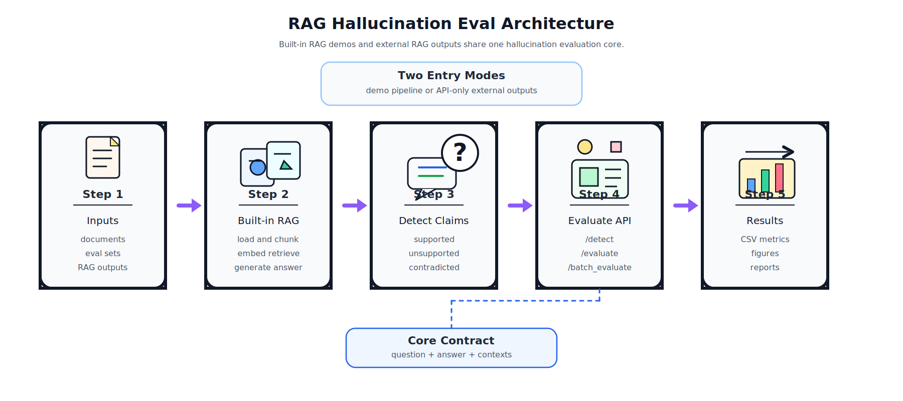
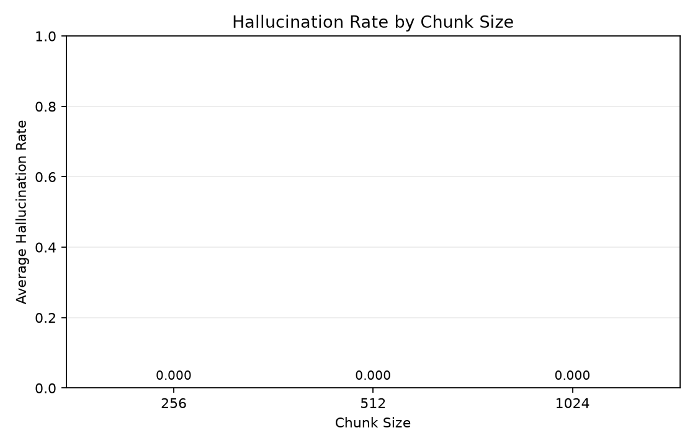
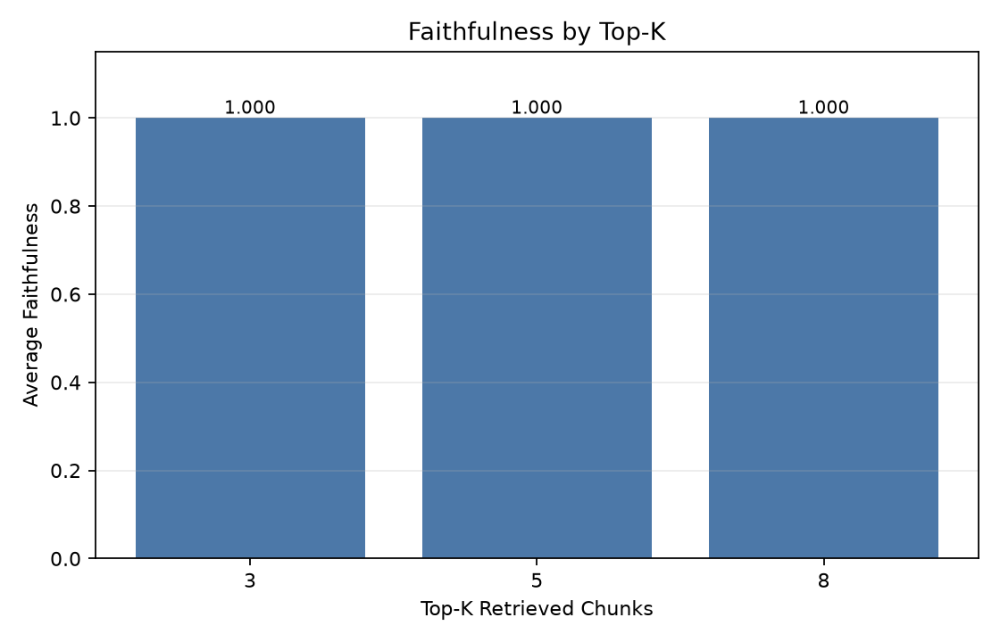
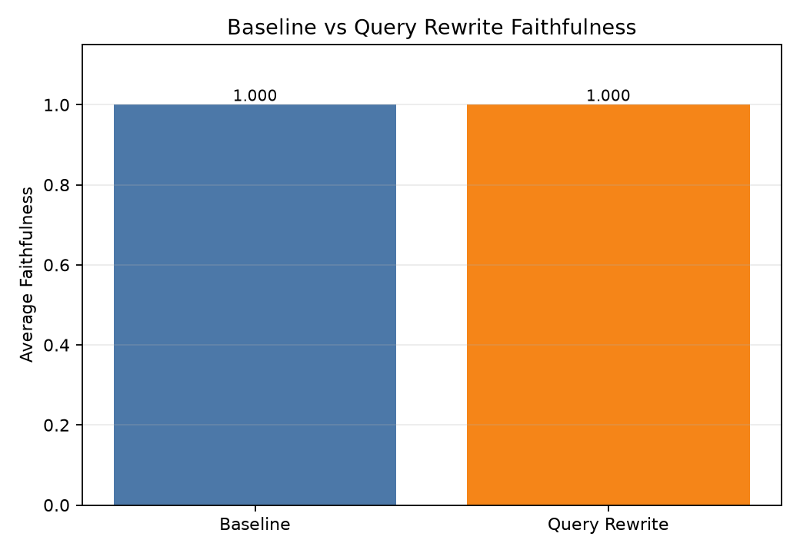

# RAG Hallucination Eval


> A local-first RAG evaluation project for detecting unsupported claims in generated answers.
>
> [中文 README](README.md)

### Overview

RAG Hallucination Eval is a local-first evaluation project for retrieval-augmented generation systems. It builds a vector index from local documents, retrieves relevant context for a user question, asks an LLM to generate a citation-aware answer, and then checks whether each answer claim is supported by the retrieved context.

The default provider is Qwen through an OpenAI-compatible API. OpenAI, DeepSeek, and mock execution are also supported. The project can still run without an API key or downloadable embedding model by using mock LLM output and deterministic hashing embeddings.

### Features

| Area | Description |
|---|---|
| Document loading | Reads `.txt`, `.md`, and `.pdf` files into internal `Document` objects |
| Chunking | Splits text with configurable chunk size and overlap while preserving metadata |
| Retrieval | Uses `BAAI/bge-small-en-v1.5` by default and falls back to hashing embeddings |
| Generation | Uses a context-grounded prompt and citation-style references such as `[1]` |
| Hallucination detection | Labels claims as `supported`, `unsupported`, `contradicted`, or `unclear` |
| Evaluation | Reports faithfulness, answer relevancy, context precision, citation accuracy, and hallucination rate |
| Query rewriting | Uses the active LLM provider to rewrite questions into retrieval-oriented queries |
| Experiments | Includes baseline runs, chunk/top-k/query rewrite ablations, and Matplotlib plots |
| Demo | Provides a Streamlit interface for indexing, asking questions, and inspecting metrics |

### Directory Layout

```text
rag-hallucination-eval/
├── api/
│   └── server.py
├── app/
│   └── streamlit_app.py
├── data/
│   ├── documents/
│   │   └── sample_llm_notes.md
│   ├── eval_sets/
│   │   ├── sample.json
│   │   └── ragbench_covidqa_1000.json
│   ├── imported/
│   └── processed/
├── docs/
│   ├── api.md
│   └── datasets.md
├── experiments/
│   ├── run_baseline.py
│   ├── run_ablation.py
│   └── plot_results.py
├── src/
│   ├── config.py
│   ├── document_loader.py
│   ├── chunker.py
│   ├── embedder.py
│   ├── retriever.py
│   ├── generator.py
│   ├── hallucination_detector.py
│   ├── evaluator.py
│   └── pipeline.py
├── tests/
├── .env.example
├── requirements.txt
├── README_EN.md
└── README.md
```

### Architecture



### How It Works

1. **Document normalization**  
   `src/document_loader.py` converts source files into `Document` objects. PDF files are parsed by page, and source metadata is retained.

2. **Chunking with traceability**  
   `src/chunker.py` creates overlapping chunks while carrying `source`, `page`, and `chunk_id` metadata forward.

3. **Vector retrieval**  
   `src/embedder.py` tries sentence-transformers first. If that fails, deterministic hashing embeddings keep tests and demos runnable. `src/retriever.py` stores and searches vectors with FAISS.

4. **Context-grounded generation**  
   `src/generator.py` builds a fixed prompt that instructs the model to answer only from retrieved context and to report insufficient context when needed. Qwen calls use the DashScope OpenAI-compatible endpoint.

5. **Query rewriting**  
   `src/query_rewriter.py` calls the active LLM provider when `use_query_rewrite=True` and rewrites the natural-language question into a shorter retrieval query. Mock mode or missing provider keys fall back to the original question.

6. **Claim-level detection**  
   `src/hallucination_detector.py` checks smaller answer spans against retrieved context and returns support labels.

7. **Metric calculation**  
   `src/evaluator.py` computes faithfulness, answer relevancy, context precision, citation accuracy, and hallucination rate. The fallback evaluator uses lexical overlap for reproducible local runs.

### Quick Start

```bash
python3 -m venv .venv
source .venv/bin/activate
pip install -r requirements.txt
cp .env.example .env
python -m pytest
```

### Configuration

Edit `.env`:

| Variable | Default | Description |
|---|---|---|
| `LLM_PROVIDER` | `qwen` | One of `qwen`, `openai`, `deepseek`, `mock` |
| `QWEN_API_KEY` | `your_key` | Qwen API key |
| `QWEN_MODEL` | `qwen-plus` | Qwen model name |
| `OPENAI_API_KEY` | `your_key` | OpenAI API key |
| `DEEPSEEK_API_KEY` | `your_key` | DeepSeek API key |
| `EMBEDDING_MODEL` | `BAAI/bge-small-en-v1.5` | sentence-transformers model |
| `VECTOR_STORE_PATH` | `data/processed/faiss_index` | FAISS index output path |
| `DEFAULT_CHUNK_SIZE` | `512` | Default chunk size |
| `DEFAULT_CHUNK_OVERLAP` | `80` | Default chunk overlap |
| `DEFAULT_TOP_K` | `5` | Default retrieval depth |
| `MOCK_LLM` | `false` | Set to `true` for local runs without real API calls |

Qwen configuration:

```bash
LLM_PROVIDER=qwen
QWEN_API_KEY=your_qwen_api_key
QWEN_MODEL=qwen-plus
MOCK_LLM=false
```

Local-only configuration:

```bash
MOCK_LLM=true
```

### Usage

Run the baseline:

```bash
python experiments/run_baseline.py
```

Run ablations:

```bash
python experiments/run_ablation.py
```

Generate plots:

```bash
python experiments/plot_results.py
```

Start the Streamlit demo:

```bash
streamlit run app/streamlit_app.py
```

Open `http://localhost:8501`, click `Build Index`, ask a question, and inspect the answer, retrieved contexts, unsupported spans, and metrics.

Start the hallucination detection API:

```bash
uvicorn api.server:app --host 0.0.0.0 --port 8000
```

Open the API docs:

```text
http://127.0.0.1:8000/docs
```

Evaluate output from an external RAG system:

```bash
curl -s http://127.0.0.1:8000/evaluate \
  -H "Content-Type: application/json" \
  -d '{
    "question": "What problem does LoRA solve?",
    "answer": "LoRA reduces trainable parameters by injecting low-rank matrices. [1]",
    "contexts": [
      "LoRA reduces trainable parameters by injecting low-rank matrices into model weights."
    ],
    "reference_answer": "LoRA reduces trainable parameters during fine-tuning.",
    "gold_context": "LoRA reduces trainable parameters by injecting low-rank matrices into model weights."
}'
```

Use `POST /batch_evaluate` for batch external RAG outputs. See [docs/api.md](docs/api.md).

External open-source RAG smoke test results are documented in [docs/external_ragflow_eval.md](docs/external_ragflow_eval.md).

Import an external evaluation dataset:

```bash
python scripts/import_datasets.py \
  --source ragbench \
  --input /path/to/ragbench.jsonl \
  --output data/eval_sets/ragbench_eval.json \
  --limit 1000 \
  --require-context
```

Supported import profiles are `ragtruth`, `ragbench`, `halueval`, and `generic`. See [docs/datasets.md](docs/datasets.md).

Generate a 1000-row local RAGBench eval set:

```bash
python scripts/download_ragbench_sample.py \
  --subset covidqa \
  --split train \
  --limit 1000 \
  --output data/eval_sets/ragbench_covidqa_1000.json
```

The repository includes `data/eval_sets/ragbench_covidqa_1000.json`, sourced from RAGBench `covidqa/train`. It contains 1000 rows: 858 `supported` rows and 142 `unsupported` rows.

### Run Results

Baseline output:

```text
Saved 5 rows to results/baseline_results.csv
avg_faithfulness: 1.0000
avg_answer_relevancy: 0.3919
avg_context_precision: 0.4000
avg_hallucination_rate: 0.0000
```

Baseline metrics:

| Metric | Value |
|---|---:|
| Samples | 5 |
| avg_faithfulness | 1.0000 |
| avg_answer_relevancy | 0.3919 |
| avg_context_precision | 0.4000 |
| avg_hallucination_rate | 0.0000 |

Ablation output:

```text
[1/10] Running chunk_size_256
  ok faithfulness=1.0000 hallucination_rate=0.0000
[2/10] Running chunk_size_512
  ok faithfulness=1.0000 hallucination_rate=0.0000
[3/10] Running chunk_size_1024
  ok faithfulness=1.0000 hallucination_rate=0.0000
[4/10] Running top_k_3
  ok faithfulness=1.0000 hallucination_rate=0.0000
[5/10] Running top_k_5
  ok faithfulness=1.0000 hallucination_rate=0.0000
[6/10] Running top_k_8
  ok faithfulness=1.0000 hallucination_rate=0.0000
[7/10] Running query_rewrite_false
  ok faithfulness=1.0000 hallucination_rate=0.0000
[8/10] Running query_rewrite_true
  ok faithfulness=1.0000 hallucination_rate=0.0000
[9/10] Running reranker_false
  ok faithfulness=1.0000 hallucination_rate=0.0000
[10/10] Running reranker_true
  ok faithfulness=1.0000 hallucination_rate=0.0000
Saved 10 ablation rows to results/ablation_results.csv
```

Ablation summary:

| Setting | Faithfulness | Answer Relevancy | Context Precision | Hallucination Rate |
|---|---:|---:|---:|---:|
| chunk_size_256 | 1.0000 | 0.2417 | 0.2800 | 0.0000 |
| chunk_size_512 | 1.0000 | 0.3919 | 0.4000 | 0.0000 |
| chunk_size_1024 | 1.0000 | 0.3253 | 1.0000 | 0.0000 |
| top_k_3 | 1.0000 | 0.3919 | 0.4000 | 0.0000 |
| top_k_5 | 1.0000 | 0.3919 | 0.4000 | 0.0000 |
| top_k_8 | 1.0000 | 0.3919 | 0.4000 | 0.0000 |

Generated plots:








### Outputs

| Path | Description |
|---|---|
| `results/baseline_results.csv` | Baseline evaluation output |
| `results/ablation_results.csv` | Ablation summary |
| `results/ablation_runs/` | Per-run ablation details |
| `results/figures/` | Generated Matplotlib figures |
| `data/processed/faiss_index*` | Local FAISS index files |

### Validation

Latest local test run:

```text
19 passed, 1 warning
```

### Limitations

- The reranker switch is still a placeholder for future implementation.
- Query rewriting uses the configured LLM provider and falls back to the original question in mock mode or when provider keys are missing.
- The fallback evaluator uses lexical overlap and is not a high-precision semantic judge.
- Ragas, DeepEval, and LettuceDetect are not required by the stable local workflow.
- No `LICENSE` file is currently included. Add one before treating the repository as formally open source.
